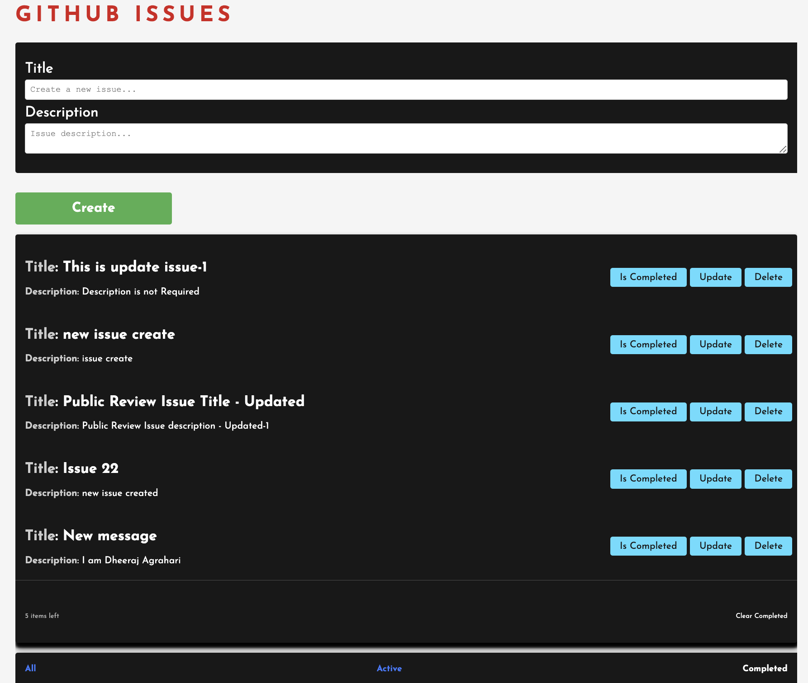

# GitHub Issue DOM Project

This project is a simple web application for managing GitHub-like issues using the DOM. It allows users to create, update, and delete issues, as well as mark them as completed. The application provides filtering options to view all issues, active issues, or completed issues.

## Table of Contents

- [Demo](#demo)
- [Features](#features)
- [Getting Started](#getting-started)
- [Usage](#usage)
- [Contributing](#contributing)
- [License](#license)

## Demo




## Features

- Create a new issue
- Update issue details
- Mark issues as completed or active
- Delete issues
- Filter issues by status (All, Active, Completed)

## Getting Started

These instructions will help you set up the project on your local machine.

1. Clone the repository:

    ```bash
    git clone https://github.com/agraharidheeraj/Dom-Issues-Project.git
    ```

2. Navigate to the project directory:

    ```bash
    GithubIssuesproject
    ```

3. Open the `index.html` file in your web browser.

## Usage

1. **Create a new issue:**
   - Enter the issue title in the "Create a new issue..." input.
   - Enter the issue description in the "Issue description..." textarea.
   - Click the "Create" button.

2. **Update an issue:**
   - Click the "Update" button on the respective issue.
   - Modify the title or description in the update overlay.
   - Click the "Update" button to save changes.

3. **Mark an issue as completed or active:**
   - Click the "Is Completed" button on the respective issue.

4. **Delete an issue:**
   - Click the "Delete" button on the respective issue.

5. **Filter issues:**
   - Click on the filter buttons ("All," "Active," "Completed") to view issues based on their status.

## Contributing

If you'd like to contribute to the project, please follow these steps:

1. Fork the repository.
2. Create a new branch: `git checkout -b feature/your-feature-name`
3. Commit your changes: `git commit -am 'Add some feature'`
4. Push to the branch: `git push origin feature/your-feature-name`
5. Submit a pull request.

## License

This project is licensed under the MIT License - see the [LICENSE](LICENSE) file for details.
